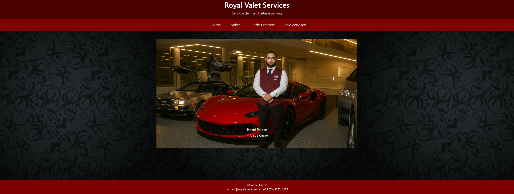
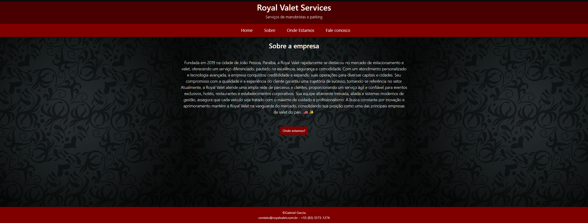
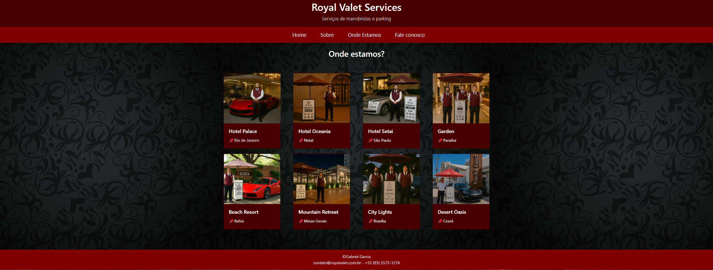
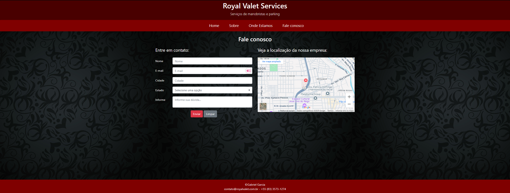

# Projeto Página Royal Valet

Este repositório contém o desenvolvimento da página web da Royal Valet, elaborado como projeto de conclusão de curso.  
O objetivo principal é apresentar os serviços da empresa de forma clara, responsiva e funcional, proporcionando uma experiência agradável aos usuários.

## 📄 Sobre o Projeto

A página da Royal Valet foi desenvolvida para representar a identidade da empresa no ambiente digital.  
O projeto inclui seções como página inicial, sobre, contato e localização, facilitando a navegação e o acesso às informações pelos clientes.

## 🚀 Funcionalidades

- Página inicial com informações destacadas sobre os serviços oferecidos.
- Seção "Sobre" detalhando a missão e valores da empresa.
- Formulário de contato funcional para facilitar a comunicação com os clientes.
- Mapa interativo na seção "Onde Estamos" para indicar a localização da empresa.
- Layout responsivo adaptado para diferentes dispositivos (desktop, tablet, mobile).

## 🖼️ Capturas de Tela

### Página Inicial


### Sobre a Empresa


### Contato


### Onde Estamos


## 🛠️ Tecnologias Utilizadas

- **HTML5**: Estruturação das páginas.
- **CSS3**: Estilização e responsividade.
- **JavaScript**: Interatividade e funcionalidades dinâmicas.
- **PHP**: Inclusão de componentes reutilizáveis como cabeçalho e rodapé.

## 📁 Estrutura do Projeto

O projeto está organizado da seguinte forma:

Projeto_pagina_royalvalet/
├── assets/
│ └── [imagens das capturas de tela]
├── css/
│ └── estilo.css
├── imagens/
│ └── [imagens utilizadas no site]
├── js/
│ └── script.js
├── cabecalho.php
├── rodape.php
├── pagina-inicial.php
├── sobre.php
├── contato.php
├── onde_estamos.php
└── texte!!!.txt


## ⚙️ Como Executar o Projeto

1. Clone o repositório:

   ```bash
   git clone https://github.com/gaarciia/Projeto_pagina_royalvalet.git
